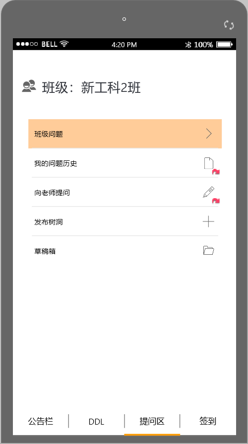

# Wechat_Program

**Team Member: Zheng Zhiyuan, Yuan Xue'ning, Xie Hanxiao, Li Hao, Zhao Silan**

## Project Description

​	In the university, we often receive various notices from class cadres, and we are exhausted by many DDLs. It is also difficult for us to communicate effectively and ask questions with our teachers. Many students will ruin their studies because of skipping classes. Based on the above, we have made up the idea and formed the prototype of this WeChat applet.

## Function Description

### 1.Bulletin Board

​	The bulletin board page implements the daily notification release function, and in addition, we stipulate that only class cadres can issue announcements.

​	When we click on the announcement, we can view the details.

​	Below is a subpage of the writing announcement.

### 2.DDL

​	On this page, we can view our own personal DDL, or switch to class DDL, and also support adding personal DDL and checking the completed DDL.

### 3.Q&A Part

​	On this page, we are divided into a teacher and a student, so that the two sides can communicate with each other.

​	**Due to too many pages, please do not show here. For details, please open the .mp file with Mockplus.**

### 4.Face Sign In

​	With the face recognition system and the positioning system, the attendance of the class is more effective, and the behavior such as signing is prevented, and the attendance rate is improved.

It also provides functions such as viewing historical check-in records.

## Postscript

​	These are just the prototypes we have made, and we hope that they will be realized in the future.